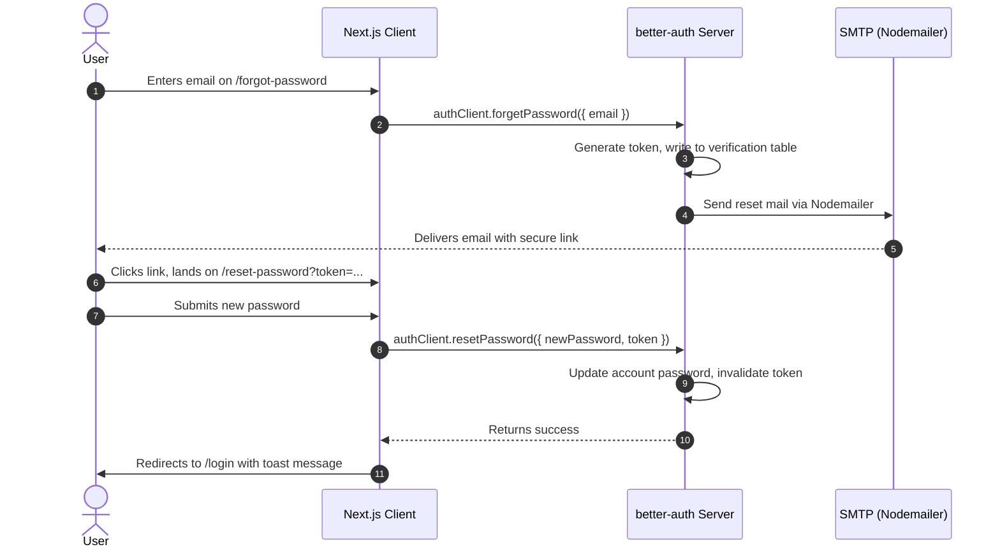

# Product Requirements & Implementation Spec: Forgot Password Flow

This document details the product requirements and technical implementation plan for introducing a secure **Forgot Password / Reset Password** flow using `better-auth` and `nodemailer`.

---

## 1. Context & "Why Now"

### The Problem
Currently, if a user forgets their password, they are locked out of their account indefinitely. There is no self-service mechanism for password recovery. This leads to user frustration, abandoned accounts, and manual database interventions to reset user credentials.

### Why Now?
As user adoption grows, the frequency of locked-out users increases. Restoring password access independently is a baseline security and user experience expectation. Delivering this self-service recovery system immediately unblocks users, maintains engagement, and reduces administrative overhead.

---

## 2. Success Criteria

We will measure the success of this feature through the following key indicators:
*   **High Recovery Rate**: Over 90% of users who request a password reset successfully complete the flow and log back in.
*   **Zero Manual Support Tickets**: Elimination of developer or admin intervention for manual password resets.
*   **Frictionless UX**: Users can complete the entire forgot-to-reset flow in under 2 minutes.

---

## 3. Product Press Release (PR/FAQ)

### Press Release
> **FOR IMMEDIATE RELEASE**
>
> **Cover Page Generator Unveils Secure Password Recovery**
>
> **Dhaka, Bangladesh** — Today, the Cover Page Generator team announced the launch of an automated, self-service password recovery feature. Students who forget their login credentials can now securely reset their passwords in under a minute. 
> 
> By entering their registered email, users instantly receive a secure, time-limited reset link. This link takes them to a streamlined interface where they can set a new password and immediately return to generating lab cover pages. This update eliminates authentication roadblocks and ensures students never lose access to their templates during critical deadline weeks.

### FAQ
*   **Q: How long are password reset links valid?**
    *   **A**: Password reset links expire after 1 hour to maintain user security.
*   **Q: Can I use this feature if I registered with Google?**
    *   **A**: No. Users logged in via Google OAuth should use Google's native recovery flow. This feature is specifically for email-and-password credentials.
*   **Q: How do we prevent spam/abuse?**
    *   **A**: The better-auth backend validates that requests are linked to real registered accounts before dispatching any recovery email.

---

## 4. Technical Architecture

The reset flow is orchestrated across the Next.js client, `better-auth` handlers, and `nodemailer`.



### 4.1 Environment Variables (`.env`)
Add Gmail SMTP configuration to connect `nodemailer`:

```env
EMAIL_USER=your-email@gmail.com
EMAIL_PASS=your-app-password
```

### 4.2 Modular Email Service (`src/lib/email/`)
A scalable, modular email directory structure designed for extension:

#### 1. Transporter (`src/lib/email/transporter.ts`)
Validates environment variables and initializes the Gmail transporter:
```typescript
import nodemailer from "nodemailer";

if (process.env.NODE_ENV === "production" && (!process.env.EMAIL_USER || !process.env.EMAIL_PASS)) {
  throw new Error("EMAIL_USER and EMAIL_PASS must be set in environment variables");
}

export const transporter = nodemailer.createTransport({
  service: "gmail",
  auth: {
    user: process.env.EMAIL_USER,
    pass: process.env.EMAIL_PASS,
  },
});
```

#### 2. Templates (`src/lib/email/templates.ts`)
Generates structured HTML layouts (Base, Reset Password, Welcome, Role Promotion):
```typescript
interface BaseTemplateParams {
  title: string;
  name: string;
  bodyHtml: string;
}

export function getBaseTemplate({ title, name, bodyHtml }: BaseTemplateParams): string {
  return `
    <div style="font-family: sans-serif; max-width: 600px; margin: 0 auto; padding: 20px; border: 1px solid #e5e7eb; border-radius: 8px;">
      <h2 style="color: #1e293b; margin-bottom: 16px;">${title}</h2>
      <p style="color: #334155; font-size: 16px; line-height: 24px;">Hi ${name},</p>
      ${bodyHtml}
      <hr style="border: none; border-top: 1px solid #e5e7eb; margin: 24px 0;" />
      <p style="font-size: 12px; color: #6b7280;">This email was sent by Cover Page Generator.</p>
    </div>
  `;
}

export function getResetPasswordTemplate(name: string, url: string): string {
  return getBaseTemplate({
    title: "Reset Your Password",
    name,
    bodyHtml: `
      <p style="color: #334155; font-size: 16px; line-height: 24px;">We received a request to reset your password. Click the button below to secure your account:</p>
      <a href="${url}" style="display: inline-block; background-color: #2563eb; color: white; padding: 12px 24px; text-decoration: none; border-radius: 6px; font-weight: 500; margin: 16px 0;">
        Reset Password
      </a>
      <p style="color: #64748b; font-size: 14px;">If you did not request a password reset, you can safely ignore this email.</p>
      <p style="color: #94a3b8; font-size: 12px;">This link will expire in 1 hour.</p>
    `,
  });
}
```

#### 3. Service API (`src/lib/email/index.ts`)
Unified, highly readable functions for dispatching specific emails:
```typescript
import { transporter } from "./transporter";
import { getResetPasswordTemplate } from "./templates";

interface SendMailParams {
  to: string;
  subject: string;
  html: string;
}

export async function sendEmail({ to, subject, html }: SendMailParams) {
  if (!process.env.EMAIL_USER || !process.env.EMAIL_PASS) {
    console.log("==========================================");
    console.log(`[EMAIL FALLBACK] To: ${to}`);
    console.log(`[EMAIL FALLBACK] Subject: ${subject}`);
    console.log("==========================================");
    return { success: true, messageId: "fallback-id" };
  }

  try {
    const info = await transporter.sendMail({
      from: `"Cover Page Generator" <${process.env.EMAIL_USER}>`,
      to,
      subject,
      html,
    });
    return { success: true, messageId: info.messageId };
  } catch (error: any) {
    console.error("Email send failed:", error);
    return { success: false, error: error.message };
  }
}

export async function sendResetPasswordEmail(to: string, name: string, url: string) {
  const html = getResetPasswordTemplate(name, url);
  return sendEmail({
    to,
    subject: "Reset your Cover Page Generator password",
    html,
  });
}
```

### 4.3 better-auth Server Config (`src/lib/auth.ts`)
Implement the `sendResetPassword` callback inside `emailAndPassword` settings:

```typescript
import { sendResetPasswordEmail } from "@/lib/email";

export const auth = betterAuth({
  // ... existing configs
  emailAndPassword: {
    enabled: true,
    minPasswordLength: 6,
    sendResetPassword: async ({ user, url }) => {
      await sendResetPasswordEmail(user.email, user.name, url);
    },
  },
  // ... plugins
});
```

### 4.4 Form Validation Schemas (`src/lib/validations/auth.ts`)
Strict Zod validation schemas for safe action inputs:

```typescript
import { z } from "zod";

export const forgotPasswordSchema = z.object({
  email: z.string().email("Invalid email address"),
});

export const resetPasswordSchema = z.object({
  password: z.string().min(6, "Password must be at least 6 characters"),
  confirmPassword: z.string().min(6, "Confirm password must be at least 6 characters"),
}).refine((data) => data.password === data.confirmPassword, {
  message: "Passwords do not match",
  path: ["confirmPassword"],
});
```

---

## 5. UI Requirements & Routes

### 5.1 Route: `/forgot-password`
*   **Path**: `src/app/(auth)/forgot-password/page.tsx`
*   **Layout**: Matching register/login form layouts.
*   **Component**: Client form containing email field.
*   **Interactions**:
    *   Displays sending state (`Loader2` spinner).
    *   On success, renders a success message telling the user to check their email.
    *   Option to go back to login.

### 5.2 Route: `/reset-password`
*   **Path**: `src/app/(auth)/reset-password/page.tsx`
*   **Layout**: Standard auth container.
*   **Component**: Client form containing new password and confirm password fields.
*   **Token retrieval**: Reads token from the search query parameter (`?token=...`). If token is missing, displays an error state.
*   **Interactions**:
    *   Calls `authClient.resetPassword({ newPassword, token })` on submit.
    *   Handles loaders and validation errors.
    *   On success, triggers a hot toast: "Password reset successfully!" and redirects to `/login`.

---

## 6. Actionable Implementation Steps

1.  **Dependencies**:
    *   Install `nodemailer` and `@types/nodemailer`.
2.  **Environment Setup**:
    *   Add SMTP variables to local `.env`.
3.  **Transporter Service**:
    *   Create helper file `src/lib/email.ts`.
4.  **better-auth Configuration**:
    *   Inject `sendResetPassword` callback inside `src/lib/auth.ts`.
5.  **Page Components**:
    *   Build the request form in `/forgot-password`.
    *   Build the reset form in `/reset-password`.
6.  **Verify & Test**:
    *   Test email dispatching locally using a local mail server test tool (e.g. Mailtrap or Maildev) or Gmail App Passwords.
