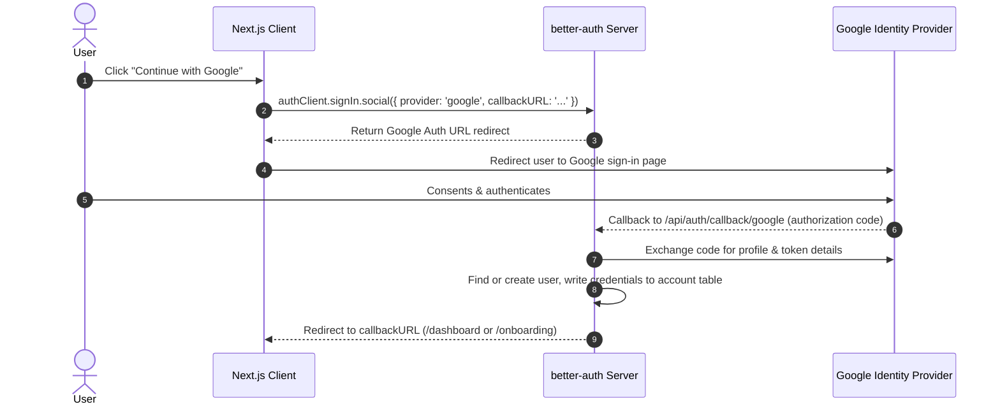

# Product Requirements & Implementation Spec: Google Login Integration

This document details the product requirements and technical implementation plan for integrating **Google OAuth / Social Sign-In** into the Sign-In and Sign-Up flows using `better-auth`.

---

## 1. Context & "Why Now"

### The Problem
Traditional email/password registration introduces entry friction (e.g., verifying emails, remembering passwords). For students rushing to generate lab cover pages, this extra friction can lead to drop-offs or password retrieval queries.

### Why Now?
Google Authentication provides a secure, single-click onboarding and login mechanism. Since most university students already use Google accounts (personal or institutional), this removes sign-up barriers, increases user conversion, and provides immediate secure access to the app.

---

## 2. Success Criteria

We will measure success based on the following metrics:
*   **One-Click Signup/Signin**: Users can sign up or sign in in under 5 seconds.
*   **Zero Email Verification Needed**: Google handles verification, allowing users to bypass standard email-verification hurdles.
*   **Correct Lifecycle Redirection**: New sign-ups via Google go directly to `/onboarding`, whereas returning users land on `/dashboard`.

---

## 3. Product Press Release (PR/FAQ)

### Press Release
> **FOR IMMEDIATE RELEASE**
>
> **Cover Page Generator Launches Seamless Google Sign-In**
>
> **Dhaka, Bangladesh** — Today, the Cover Page Generator team launched Google Authentication. Students can now access and generate cover pages instantly without managing another set of password credentials.
>
> With this update, students can register or log in using their pre-existing Google credentials. The system automatically detects new registrations and redirects them to the onboarding sequence, while existing users go straight to their dashboard. This significantly cuts setup time, enabling students to finalize their lab report cover pages even faster under pressure.

### FAQ
*   **Q: What happens if I already have an email account and then click "Continue with Google"?**
    *   **A**: If the email addresses match, `better-auth` securely links the Google login to the existing user profile by default, preventing account duplication.
*   **Q: Will Google logins require onboarding?**
    *   **A**: Yes. First-time users will be redirected to the mandatory onboarding page (`/onboarding`) to configure their profile (university, department, roll number, etc.) before they can access the dashboard.
*   **Q: What redirect URIs need to be set in Google Console?**
    *   **A**: For local development, `http://localhost:3000/api/auth/callback/google`. For production, `https://your-domain.com/api/auth/callback/google`.

---

## 4. Technical Architecture

The Google sign-in flow uses the better-auth client library and the server auth endpoint.



### 4.1 Environment Variables (`.env`)
The local `.env` and production settings require Google Client ID & Secret:

```env
GOOGLE_CLIENT_ID=your-google-client-id.apps.googleusercontent.com
GOOGLE_CLIENT_SECRET=your-google-client-secret
```

### 4.2 better-auth Server Config (`src/lib/auth.ts`)
Add the `account.accountLinking` and `socialProviders.google` blocks within `betterAuth` configuration:

```typescript
export const auth = betterAuth({
  database: drizzleAdapter(db, {
    provider: "pg",
  }),
  account: {
    accountLinking: {
      enabled: true,
      trustedProviders: ["google"],
    },
  },
  // ... other config (user, emailAndPassword, plugins)
  socialProviders: {
    google: {
      clientId: process.env.GOOGLE_CLIENT_ID as string,
      clientSecret: process.env.GOOGLE_CLIENT_SECRET as string,
      // Optional: force account selection screen on Google auth
      prompt: "select_account",
    },
  },
});
```

### 4.3 Client Usage
Both `/login` and `/register` pages trigger authentication with the `authClient.signIn.social` method redirecting to `/dashboard`.

```typescript
const handleGoogleLogin = async () => {
  try {
    setError("");
    setGoogleLoading(true);

    const { error } = await authClient.signIn.social({
      provider: "google",
      callbackURL: "/dashboard",
    });

    if (error) {
      setError(error.message ?? "Google sign in is currently unavailable.");
    }
  } catch {
    setError("Google sign in is currently unavailable.");
  } finally {
    setGoogleLoading(false);
  }
};
```

---

## 5. Actionable Implementation Steps

1.  **Environment Configuration**:
    *   Add `GOOGLE_CLIENT_ID` and `GOOGLE_CLIENT_SECRET` to local `.env`.
2.  **Server Config Integration**:
    *   Modify `src/lib/auth.ts` to add the `socialProviders.google` credentials.
3.  **UI Event Handlers**:
    *   Update `src/app/(auth)/login/page.tsx`'s Google Login handler.
    *   Update `src/app/(auth)/register/page.tsx`'s Google Login handler (with error catching and loading state).
4.  **Verification**:
    *   Verify login flow works locally.
    *   Verify redirection to `/onboarding` for new users.
    *   Verify redirection to `/dashboard` for returning users.
