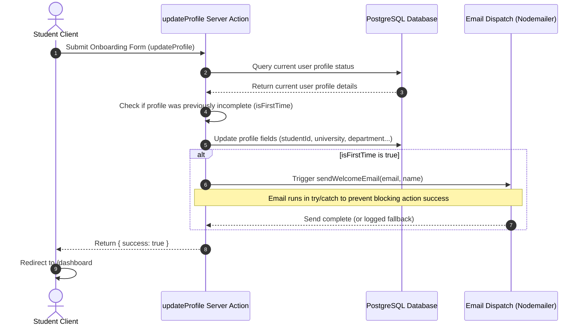

# Product Requirements & Implementation Spec: Welcome Email on Onboarding Completion

This document details the product requirements and technical implementation plan for sending a **Welcome Email** to users when they complete their profile details on the onboarding form.

---

## 1. Context & "Why Now"

### The Problem

When users sign up (either via email/password or Google OAuth), they are immediately redirected to the mandatory `/onboarding` screen. Sending a welcome email at the moment of signup has two main flaws:

1. The user has not yet completed their profile (university, department, etc.), meaning they cannot access the dashboard.
2. The welcome email can only include their name, missing the opportunity to acknowledge their academic profile or provide tailored guidance.
3. Sending the welcome email before onboarding completes leads to a disjointed user experience if they click "Go to Dashboard" in the email, only to be blocked by the onboarding guard.

### Why Now?

By sending the welcome email **immediately after successful onboarding completion**:

- We ensure the user is fully set up and can immediately access the dashboard from the email.
- We confirm the user is active, reducing email volume to spam/inactive accounts that sign up but never onboard.
- We can personalize the email with their name and ensure a smooth user transition.

---

## 2. Success Criteria

We will measure success based on the following metrics:

- **Onboarding Success Integration**: The email is triggered upon the first successful submission of the onboarding profile form.
- **Idempotency**: The welcome email must be sent **exactly once**. Subsequent updates to profile settings (via `/settings`) must not re-trigger the welcome email.
- **Non-blocking Dispatch**: SMTP delays or network failures during email sending must not block the user onboarding redirection flow or cause the server action to return a failure status.

---

## 3. Product Press Release (PR/FAQ)

### Press Release

> **FOR IMMEDIATE RELEASE**
>
> **CoverDe Welcomes Onboarded Students with Seamless Onboarding Confirmation**
>
> **Dhaka, Bangladesh** — Today, the CoverDe team announced the implementation of an automated onboarding confirmation system. As soon as a student completes their profile setup, they will receive a welcome email directly to their inbox.
>
> This feature marks the completion of a user's registration journey. The email greets the student by name and provides a direct shortcut link to their active dashboard, enabling them to start generating cover pages and lab report sheets instantly.

### FAQ

- **Q: Why does the welcome email not send when I first register my account?**
  - **A**: CoverDe requires all users to complete their academic profile (onboarding) before using the application. Sending the welcome email after onboarding ensures that when you click "Go to Dashboard", you can immediately create cover sheets without being stopped by profile screens.
- **Q: Will I get another email if I edit my department or university in settings?**
  - **A**: No. The system checks if your profile was previously incomplete. The welcome email is only triggered on your initial onboarding submission.
- **Q: What happens if the email system is down or SMTP credentials are missing?**
  - **A**: The onboarding process will still complete successfully, and the user will be redirected to the dashboard. The system will log a fallback message in local development or register the error in production logs without interrupting the user.

---

## 4. Technical Architecture

The onboarding completion welcome email flow is integrated directly into the `updateProfile` server action.



### 4.1 Checking Profile Completeness

To ensure the email is only sent on the _first_ onboarding completion, we query the user's profile state prior to updating it, checking all 8 fields required by `OnboardingGuard`:

```typescript
// Query user fields before update
const existingUser = await db
  .select({
    studentId: user.studentId,
    university: user.university,
    department: user.department,
    section: user.section,
    subsection: user.subsection,
    level: user.level,
    term: user.term,
    hscBatch: user.hscBatch,
  })
  .from(user)
  .where(eq(user.id, ctx.user.id))
  .limit(1)
  .then((res) => res[0]);

// If any required profile fields were null/empty, this is the first onboarding completion
const isFirstTimeOnboarding =
  !existingUser?.studentId ||
  !existingUser?.university ||
  !existingUser?.department ||
  !existingUser?.section ||
  !existingUser?.subsection ||
  !existingUser?.level ||
  !existingUser?.term ||
  !existingUser?.hscBatch;
```

### 4.2 Safe Async Dispatch

To ensure email dispatch completes before serverless execution environments terminate, the email send must be awaited. We wrap the dispatch in `try/catch` to prevent SMTP or network failures from failing the server action:

```typescript
if (isFirstTimeOnboarding) {
  try {
    await sendWelcomeEmail(ctx.user.email, ctx.user.name);
  } catch (err) {
    console.error("Failed to send welcome email during onboarding:", err);
  }
}
```

---

## 5. Actionable Implementation Steps

1. **Modify User Action**:
   - Locate [user.ts](file:///e:/Akt/Web%20Development/Next%20JS%20Course/Projects/cover-page-generator/src/app/actions/user.ts).
   - In `updateProfile`, import `sendWelcomeEmail` from `@/lib/email`.
   - Before applying the database update, query the user's current profile fields (all 8 required fields) to determine if this is their first onboarding completion.
   - Post-update, if it is their first onboarding completion, call `await sendWelcomeEmail(ctx.user.email, ctx.user.name)` inside a `try/catch` block to prevent SMTP errors from failing the action.

2. **Verification & Testing**:
   - **Local Test**: Register a new user, complete onboarding, and verify that the console outputs the welcome email contents under `[EMAIL FALLBACK]`.
   - **Idempotency Test**: Go to `/settings` or re-submit profile data, and confirm no duplicate welcome email output is generated in the logs.
   - **Error Resilience Test**: Temporarily misconfigure SMTP or simulate a network drop, and verify that onboarding still completes successfully and redirects the user to `/dashboard`.
